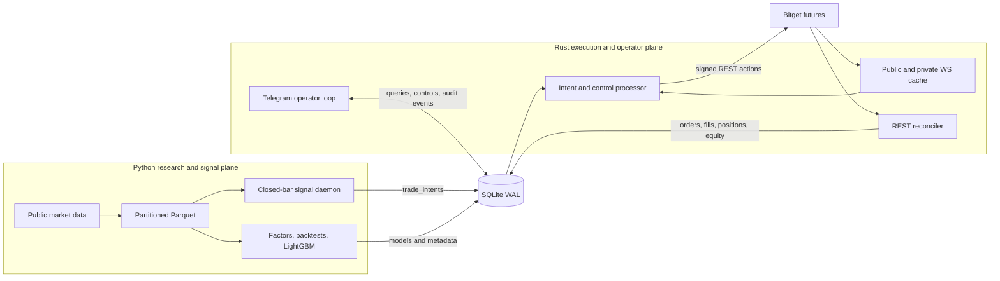

# Prodigy

[](pyproject.toml)
[](crates/executor/Cargo.toml)
[](LICENSE)
[](#project-status)
[](https://www.bitget.com/api-doc/contract/intro)

Prodigy is a quantitative crypto trading stack for Bitget USDT-M futures with compatible live and Demo execution profiles. Live trading is the primary deployment target; Demo mode is reserved for integration, safety, and order-flow testing. Python owns market-data ingestion, factor research, backtesting, model experiments, and closed-bar signal generation. A long-running Rust executor owns exchange connectivity, order state, reconciliation, risk checks, and operator controls. SQLite is the durable boundary between them.

> [!WARNING]
> This project can submit real futures orders when live mode is explicitly enabled. It is experimental software, not financial advice, and does not provide or imply a profitable strategy. Validate exchange behavior in Demo mode, inspect the source and resulting orders before live deployment, and never risk funds you cannot afford to lose.

## At a glance

| Area | Current implementation |
| --- | --- |
| Venue | Bitget USDT-M futures |
| Default market | `ETH/USDT:USDT` research symbol, mapped to `ETHUSDT` for execution |
| Research | Python, pandas, Parquet, example factors, bar simulation, LightGBM smoke training |
| Execution | Rust, Tokio, REST actions, public/private WebSocket caches, REST reconciliation |
| Coordination | SQLite WAL tables for intents, controls, orders, fills, positions, equity, events, and runtime state |
| Runtime modes | Shared live and Demo execution; live for deployment, Demo for testing; non-trading live dry validation |
| Operator interface | Telegram queries and audited `stop`, `resume`, `cancel_all`, and confirmed `close_all` controls |

## Capabilities

- **Reproducible data path:** backfills 15-minute OHLCV and funding history from public Bitget APIs into date-partitioned, gzip-compressed Parquet, with checkpoints and quality events in SQLite.
- **Research loop:** includes three intentionally simple example factors, forward-return evaluation, IC diagnostics, signal mapping, and a lot-level bar simulator with fees, rebate, funding, slippage, stop-loss, trailing exits, and holding reviews.
- **ML smoke workflow:** trains a fixed-parameter LightGBM model with purged walk-forward folds and a final holdout, then records versioned artifacts and metadata. It is an engineering example, not a published production model.
- **Closed-bar signal daemon:** refreshes data, scores only completed bars, checks reconciled SQLite state, and atomically writes idempotent `open` or `close` intents.
- **Exchange executor:** maintains public and private WebSocket state, executes through signed Bitget REST requests, tracks partial fills, and reconciles local state back to exchange truth.
- **Operational safety:** blocks new exposure on stale market data, unavailable private state, manual override, operator stop, notional or margin gates, and a 24-hour equity-loss suspension.
- **Mode isolation:** binds controls to the active executor mode and instance, prevents concurrent executors on one database, and requires a clean database before normal live startup.
- **Observability:** persists events independently of Telegram delivery and can produce a bounded 30-120 minute execution-integration report.

## Architecture



The ownership boundary is deliberate:

- Python never calls private account, position, order, or execution APIs.
- Rust is the only component allowed to place or cancel exchange orders.
- WebSocket state is a low-latency cache; REST reconciliation remains authoritative.
- Telegram never calls Bitget directly. It reads SQLite and queues mode- and instance-bound control commands.

## Runtime profiles

Live and Demo use the same signal daemon, SQLite queues, Rust execution state machine, risk checks, reconciliation rules, and Telegram controls. The profile changes only credentials, WebSocket hosts, and the Demo trading header.

| Profile | Purpose | Credentials | WebSocket host | REST trading header |
| --- | --- | --- | --- | --- |
| Live | Primary deployment profile for real Bitget futures execution | `BITGET_LIVE_*` | `ws.bitget.com` | No `PAPTRADING` header |
| Demo | Integration, smoke, and order-flow testing | `BITGET_DEMO_*` | `wspap.bitget.com` | `PAPTRADING: 1` |

The executor CLI defaults to `demo` as a fail-safe when no mode is supplied; this is a startup safety default, not a limitation of the architecture or the intended deployment model. The current owner environment has not been configured with live API credentials, so live private connectivity and order placement have not been exercised from this machine. The live profile, credential isolation, startup gates, request construction, execution path, reconciliation, and mode-bound controls are implemented in the codebase.

## Safety model

Prodigy treats risk-reducing actions differently from new exposure:

1. Margin protection and emergency de-risking have highest priority.
2. Close, reduce, and cancel paths remain available when open-only gates are active.
3. Manual intervention activates a durable per-symbol override and blocks automatic opens until the exchange has no position or working order for that symbol.
4. New opens require fresh public market data, ready private state, fresh reconciled account state, available margin, and notional capacity.
5. Opening execution attempts maker twice, confirms cancellation between attempts, rechecks risk, and uses taker only for the remaining quantity. Normal closes use one maker attempt before taker fallback; emergency closes use taker.
6. Every exchange order receives a stable client order ID, and repeated intent processing cannot create duplicate orders.

Live mode adds three independent startup gates: live credentials, `PRODIGY_LIVE_TRADING_ENABLED=1`, and an exact confirmation phrase. These checks, the active-executor lock, and the clean-database checks run before private live API activity.

## Prerequisites

- Python 3.11 or newer
- A current stable Rust toolchain with Cargo
- Git
- Network access to Bitget public APIs
- Bitget Live API credentials for live deployment, or Bitget Demo credentials for execution testing
- Jupyter only if you want to execute the research notebooks

The Rust SQLite dependency is bundled, so a separate system SQLite development package is normally unnecessary.

## Quick start

### 1. Install the workspace

```bash
git clone https://github.com/AaronL725/Prodigy.git
cd Prodigy

python3.11 -m venv .venv
source .venv/bin/activate
python -m pip install -e .

cargo build --workspace
```

### 2. Backfill public research data

```bash
prodigy-data backfill \
  --symbol "ETH/USDT:USDT" \
  --start 2024-01-01 \
  --timeframe 15m
```

The command tries a direct connection first. If that fails, its default fallback proxy is `http://127.0.0.1:7897`; override it with `--proxy-url` when your environment uses a different proxy. Data lands under `data/raw/bitget/...`, while checkpoints and data-quality events land in `var/prodigy.sqlite`.

### 3. Run the research examples

With Jupyter available, execute the notebooks to inspect each factor and build the feature frame used by the trainer:

```bash
jupyter nbconvert --execute --inplace research/notebooks/*.ipynb
prodigy-ml train --horizon 1h --model-version example-1h
```

The model artifact is written below `models/example_lgbm/`; its metadata and artifact hash are recorded in SQLite.

### 4. Configure the Demo test profile

Use the Demo profile to verify exchange integration and order behavior before deploying the same runtime against live APIs. Create an ignored `.env.local` at the repository root:

```dotenv
BITGET_DEMO_API_KEY=your_demo_api_key
BITGET_DEMO_API_SECRET=your_demo_api_secret
BITGET_DEMO_API_PASSPHRASE=your_demo_api_passphrase

# Optional Telegram operator interface
TELEGRAM_BOT_TOKEN=your_bot_token
TELEGRAM_ALLOWED_USER_IDS=123456789
TELEGRAM_CHAT_ID=123456789
```

The executor also accepts `BITGET_DEMO_SECRET_KEY` and `BITGET_DEMO_PASSPHRASE` as compatibility aliases. Never commit `.env.local`; it is already ignored.

### 5. Start an execution test loop in Demo

Run the executor first so it can reconcile exchange truth and publish fresh account state:

```bash
cargo run -p prodigy-executor -- \
  --mode demo \
  --daemon \
  --db var/prodigy.sqlite
```

In a second terminal, start the signal daemon:

```bash
source .venv/bin/activate
prodigy-signal --daemon --db var/prodigy.sqlite
```

The default `example-factors` source is intentionally a pipeline demonstration. It should not be interpreted as validated alpha.

For real operation, continue to [Live deployment](#live-deployment) after completing the integration checks. The Python signal daemon is shared by both profiles; live selection and its safety gates are enforced by the Rust executor.

## Common workflows

Run one signal cycle:

```bash
prodigy-signal --once --db var/prodigy.sqlite
```

Run a bounded Demo integration smoke session and write a Markdown report:

```bash
prodigy-smoke --duration-minutes 60
```

Generate a report from an already-running system without starting processes:

```bash
prodigy-smoke --duration-minutes 30 --skip-start
```

Validate the live profile without live keys, private REST calls, orders, or an active executor lock:

```bash
cargo run -p prodigy-executor -- --mode live --dry-validate
```

## Telegram operator interface

When `TELEGRAM_BOT_TOKEN` and `TELEGRAM_ALLOWED_USER_IDS` are set, the Rust daemon starts the Telegram loop. Authorization uses Telegram `from.id`; `TELEGRAM_CHAT_ID` is a reply or notification destination, not a permission gate.

| Type | Commands |
| --- | --- |
| Queries | `/help`, `/status`, `/positions`, `/orders`, `/trades`, `/pnl`, `/risk`, `/events`, `/smoke_status` |
| Controls | `/stop`, `/resume`, `/cancel_all`, `/close_all` |

`/cancel_all` targets system-owned working orders only. `/close_all` requires a same-user, mode-bound, instance-bound confirmation and targets system-owned positions only. Manual or imported positions are skipped and audited.

## Live deployment

> [!CAUTION]
> Live is the intended deployment profile and can place real futures orders. Passing tests and dry validation do not constitute an operational or security audit. Complete Demo integration testing, inspect all residual state, and review every risk parameter before enabling live execution.

The current owner environment does not contain live API credentials. To deploy the implemented live profile, normal live startup requires:

```dotenv
BITGET_LIVE_API_KEY=your_live_api_key
BITGET_LIVE_API_SECRET=your_live_api_secret
BITGET_LIVE_API_PASSPHRASE=your_live_api_passphrase
PRODIGY_LIVE_TRADING_ENABLED=1
PRODIGY_LIVE_CONFIRM=I_UNDERSTAND_THIS_CAN_TRADE_REAL_MONEY
```

Follow the [demo-to-live switch checklist](docs/superpowers/checklists/2026-07-07-m8-demo-to-live-switch.md) exactly. Live startup hard-fails before private API calls if the database contains unresolved intents, mismatched controls, working system orders, system positions, or a non-stale active executor lock.

After the checklist and credential gates are satisfied, start the live executor with:

```bash
cargo run -p prodigy-executor -- \
  --mode live \
  --daemon \
  --db var/prodigy.sqlite
```

## Configuration

Python research and signal settings are loaded from [`configs/default.toml`](configs/default.toml). The Rust executor currently uses compiled execution defaults plus CLI mode/database flags and environment-based credentials.

Important defaults include:

| Setting | Default |
| --- | --- |
| Trading profiles | Live and Demo; CLI defaults to `demo` as a fail-safe |
| Enabled symbol | `ETH/USDT:USDT` / `ETHUSDT` |
| Signal timeframe | `15m` |
| Exchange leverage | `5x` |
| Total notional ceiling | `5x` equity in the executor |
| Per-order target ceiling | `10%` of total notional cap |
| Minimum available margin | `5%` of equity |
| 24-hour equity-loss suspension | `10%` |
| Signal open threshold | `0.60` absolute score |
| Signal reverse-close threshold | `0.20` |
| Maximum holding review | `96` bars / 24 hours |
| SQLite intent polling | `250ms` |
| REST reconciliation | `10s` |
| Public market-data freshness | `3s` |
| Opening maker timeout | `15s` per attempt |
| Closing maker timeout | `8s` |

Leverage changes margin usage; it does not determine target notional. Review both the Python signal cap and the Rust equity-relative risk limits before running any executor.

## Repository layout

```text
Prodigy/
|-- configs/                 Python signal and research defaults
|-- crates/executor/         Rust Bitget executor, risk, reconcile, and Telegram runtime
|-- data/                    Ignored local Parquet datasets
|-- docs/superpowers/        Milestone designs, implementation plans, and operator checklists
|-- models/                  Ignored local LightGBM artifacts
|-- reports/                 Execution integration smoke reports
|-- research/notebooks/      Executable factor and feature-building notebooks
|-- schema/                  SQLite schema and execution migration
|-- src/prodigy/             Python data, research, ML, signal, smoke, and DB modules
|-- tests/                   Python unit, integration, safety, and smoke tests
`-- var/                     Ignored SQLite databases and runtime files
```

## Testing

Run the deterministic local checks:

```bash
python -m pytest --ignore=tests/test_executor_integration.py
python -m pytest tests/test_executor_integration.py \
  -k "not test_rust_demo_executor_processes_pending_intent and not test_rust_demo_daemon_processes_pending_intent_once"
cargo fmt --check
cargo clippy --workspace --all-targets --all-features -- -D warnings
cargo test --workspace --lib --bins
git diff --check
```

The complete Python suite and the dedicated Rust Demo suite require Demo credentials and network access. They can place, cancel, open, and reduce-only close Demo orders:

```bash
python -m pytest
cargo test -p prodigy-executor --test bitget_demo -- --nocapture
```

Run that suite only against a dedicated Demo account. The tests serialize account-mutating cases and fail honestly when an opened Demo position cannot be cleaned up under poor Demo-book liquidity.

## Persistence and recovery

- SQLite initializes and migrates automatically from `schema/001_initial.sql` and `schema/002_execution.sql`.
- `trade_intents` and `control_commands` have explicit lifecycle states and idempotent IDs.
- Orders, fills, positions, equity snapshots, events, task checkpoints, models, and executor state form the local audit trail.
- Reconciliation repairs missed WebSocket updates from REST and gives exchange state precedence over local assumptions.
- Active executor heartbeats allow stale-lock takeover with an audit event while rejecting concurrent non-stale executors.
- Local databases, Parquet data, model artifacts, credentials, and build outputs are excluded from Git.

## Project status

Prodigy is a personal, experimental `0.1.0` codebase with compatible live and Demo execution paths and substantial safety and failure-path coverage. Live is the primary deployment target, but the project is not an externally audited trading platform.

Known boundaries:

- The default runtime enables one symbol, `ETHUSDT`.
- The three bundled factors and LightGBM trainer are examples for exercising the pipeline; no return or robustness claim is made.
- The signal daemon currently scores example factors directly and does not load the generated LightGBM artifact for trading.
- Realized PnL is not considered reliable throughout the operator surface; the Telegram and smoke views report `n/a` instead of manufacturing a total.
- Live execution is implemented behind explicit credential, enablement, confirmation, clean-state, and active-instance gates. The current owner environment has no live keys, so current runtime evidence comes from live dry validation and Demo integration tests rather than private live API execution.
- Demo mode is a test environment only; its liquidity can be discontinuous or untradeable and should not be treated as representative live-market execution quality.
- Multi-exchange execution, remote opening, remote parameter editing, model debugging, and remote shell access are deliberately out of scope.

## Contributing

Issues and focused pull requests are welcome. Before proposing a large execution, schema, or safety change, open an issue describing the behavior and failure modes. Changes should preserve the Python/Rust ownership boundary and include focused tests; Rust changes are expected to pass formatting and Clippy with warnings denied.

## License

Prodigy is released under the [MIT License](LICENSE).
